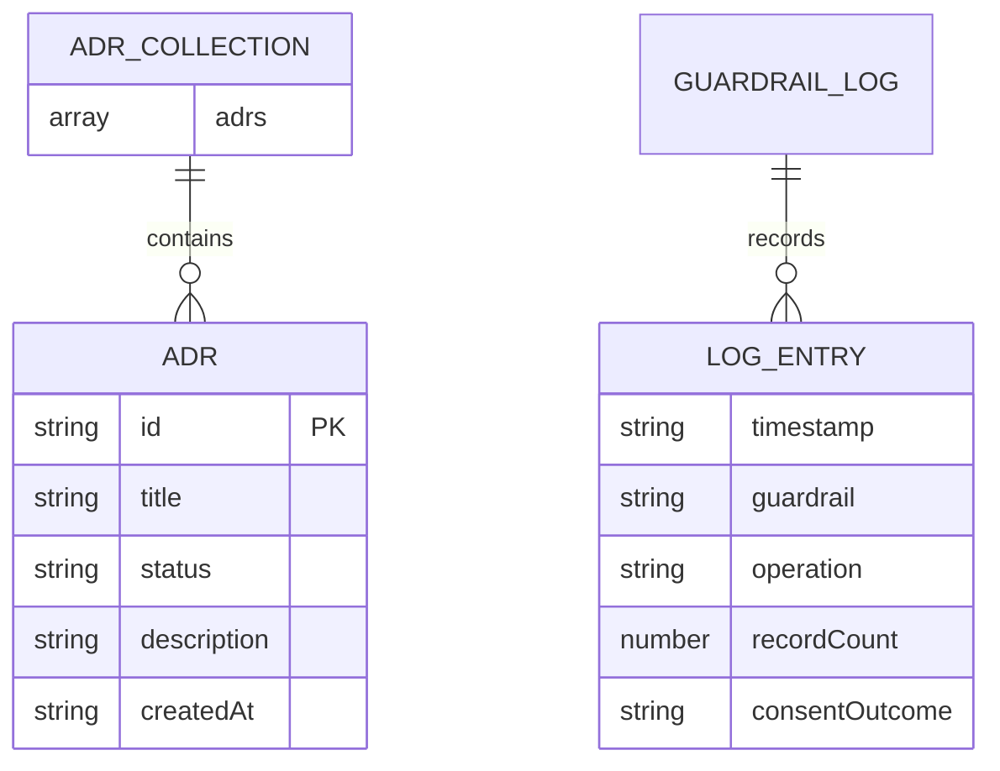

# Data Model: ADR Tracker

**Branch**: `001-adr-tracker` | **Date**: 2026-05-05 | **Spec**: [spec.md](spec.md)

## Entities

### ADR (Architecture Decision Record)

Represents a single architecture decision.

| Attribute   | Type     | Required | Constraints                                      | Spec Ref |
|-------------|----------|----------|--------------------------------------------------|----------|
| id          | string   | Yes      | Unique, generated via `crypto.randomUUID()`       | FR-012   |
| title       | string   | Yes      | Non-empty                                         | FR-001, FR-002 |
| status      | string   | Yes      | One of: `"Proposed"`, `"Accepted"`, `"Deprecated"` | FR-001, FR-007 |
| description | string   | Yes      | Non-empty; covers decision and rationale          | FR-001, FR-002 |
| createdAt   | string   | Yes      | ISO 8601 timestamp, set at creation time          | FR-013   |

**Validation Rules**:
- `title` must be a non-empty string (trimmed whitespace does not count)
- `description` must be a non-empty string (trimmed whitespace does not count)
- `status` must be exactly one of the three allowed values (case-sensitive)
- `id` must be unique across all ADRs in the collection

**State Transitions**:
- Unrestricted — any status can transition to any other status (per clarification)
- Bulk reset sets all statuses to `"Proposed"` regardless of current value

### ADR Collection

The complete set of ADRs, persisted as a JSON array.

**Storage Format** (in localStorage key `adr-tracker-data`):

```json
{
  "adrs": [
    {
      "id": "550e8400-e29b-41d4-a716-446655440000",
      "title": "Use localStorage for persistence",
      "status": "Accepted",
      "description": "We decided to use localStorage because...",
      "createdAt": "2026-05-05T14:30:00.000Z"
    }
  ]
}
```

**Ordering**: ADRs are displayed in reverse chronological order (newest `createdAt` first) — FR-013.

**Initialization**: If no data exists in localStorage on first load, the collection is initialized as `{ "adrs": [] }` — FR-014. If served via HTTP, the app attempts to `fetch('data.json')` to seed data.

### Guardrail Log Entry

Each entry in `guardrail-log.md` records a guardrail invocation.

| Attribute      | Type     | Description                                      | Spec Ref |
|----------------|----------|--------------------------------------------------|----------|
| timestamp      | string   | ISO 8601 timestamp of the guardrail invocation    | FR-015   |
| guardrail      | string   | Name of the guardrail (e.g., "Constitution Principle IV — Hard Guardrail Stops") | FR-009   |
| operation      | string   | Description of the operation (e.g., "Bulk reset all ADRs to Proposed") | FR-015   |
| recordCount    | number   | Number of records affected                        | FR-009   |
| consentOutcome | string   | `"granted"` or `"refused"`                        | FR-015, FR-016 |

**Log Format** (append-only markdown):

```markdown
## Guardrail Invocation — [TIMESTAMP]

- **Guardrail**: Constitution Principle IV — Hard Guardrail Stops
- **Operation**: Bulk reset all ADRs to Proposed
- **Records affected**: [N]
- **Consent**: [granted/refused]
```

## Entity Relationships


